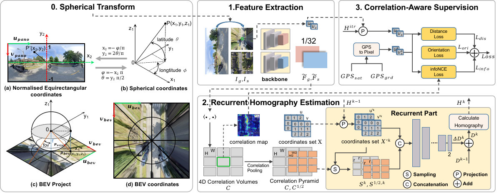
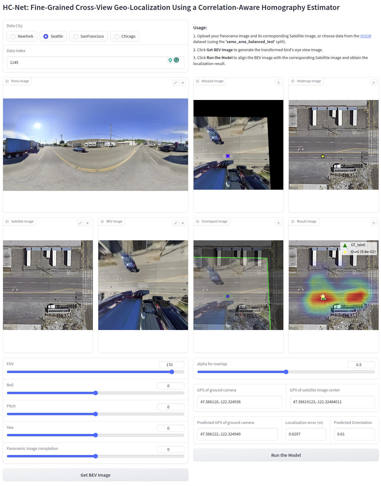
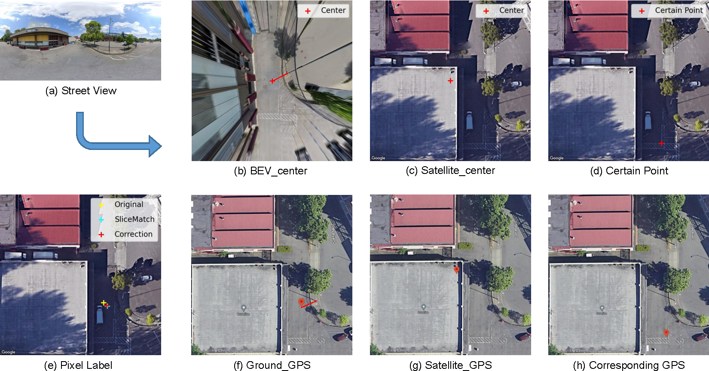
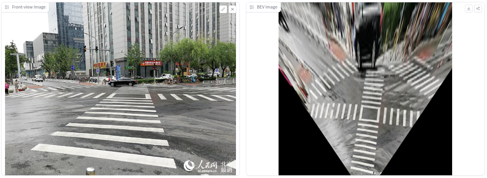
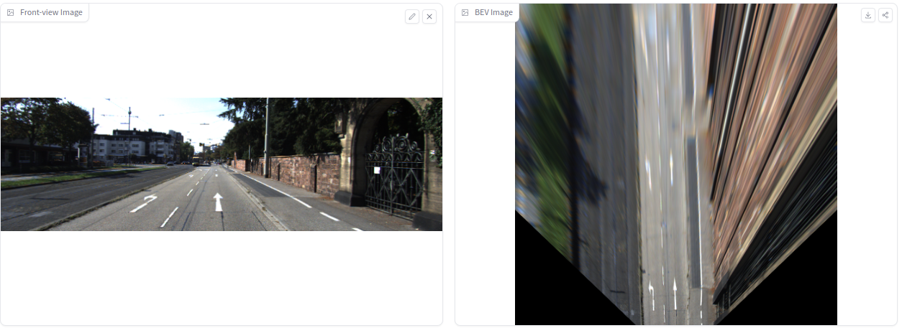

<h1 align="center"><strong>HC-Net: Fine-Grained Cross-View Geo-Localization Using a Correlation-Aware Homography Estimator</strong></h1>

<p align="center">
  <a href="https://arxiv.org/abs/2308.16906" target='_blank'>
    
  </a> 
  <a href="https://arxiv.org/pdf/2308.16906.pdf" target='_blank'>
    
  </a> 
  <a href="http://101.230.144.196:7860/" target='_blank'>
    
  </a>
  <a href="https://huggingface.co/spaces/Xiaolong-Wang/HC-Net" target='_blank'>
    
  </a>
</p>
##  🏠 About



We introduce a novel approach to fine-grained cross-view geo-localization. Our method **aligns a warped ground image with a corresponding GPS-tagged satellite image covering the same area using homography estimation.** We first employ a differentiable **spherical transform**, adhering to geometric principles, to **accurately align the perspective of the ground image with the satellite map.** To address challenges such as occlusion, small overlapping range, and seasonal variations, we propose a robust correlation-aware homography estimator to align similar parts of the transformed ground image with the satellite image. Our method achieves **sub-pixel resolution and meter-level GPS accuracy** by mapping the center point of the transformed ground image to the satellite image using a homography matrix and determining the orientation of the ground camera using a point above the central axis. Operating at a speed of 30 FPS, our method outperforms state-of-the-art techniques, **reducing the mean metric localization error by 21.3% and 32.4%** in same-area and cross-area generalization tasks on the VIGOR benchmark, respectively, and by **34.4% on the KITTI benchmark in same-area evaluation.**

## 🔥 News

- [2023-08] We release the [paper](https://arxiv.org/abs/2308.16906) of HC-Net and an online gradio [demo](http://101.230.144.196:7860).

## 🤖 Online Demo

**HC-Net is online! Try it at [this url](http://101.230.144.196:7860/).**

You can test our model using the data from the **'same_area_balanced_test.txt'** split of the [VIGOR](https://github.com/Jeff-Zilence/VIGOR) dataset, or by providing your own Panorama image along with its corresponding Satellite image.



## 🏷️ Label Correction for [VIGOR](https://github.com/Jeff-Zilence/VIGOR) Dataset



We propose the use of [Mercator projection](https://en.wikipedia.org/wiki/Web_Mercator_projection#References) to directly compute the pixel coordinates of ground images on specified satellite images using the GPS information provided in the dataset.

To use our corrected label, you can add the following content to the `__getitem__` method of the `VIGORDataset` class in `datasets.py` file in the [CCVPE](https://github.com/tudelft-iv/CCVPE) project:

```python
from Mercator import *

pano_gps = np.array(self.grd_list[idx][:-5].split(',')[-2:]).astype(float)   
pano_gps = torch.from_numpy(pano_gps).unsqueeze(0) 

sat_gps = np.array(self.sat_list[self.label[idx][pos_index]][:-4].split('_')[-2:]).astype(float)
sat_gps = torch.from_numpy(sat_gps).unsqueeze(0)     

zoom = 20
y = get_pixel_tensor(sat_gps[:,0], sat_gps[:,1], pano_gps[:,0],pano_gps[:,1], zoom) 
col_offset_, row_offset_ = y[0], y[1]

width_raw, height_raw = sat.size
col_offset, row_offset = width_raw/2 -col_offset_.item(), row_offset_.item() - height_raw/2
```

## 📷 Get BEV Image from front-view

We have released the code corresponding to section A.2 in the [paper](https://arxiv.org/abs/2308.16906)'s Supplementary, along with an online testing platform [](https://huggingface.co/spaces/Xiaolong-Wang/HC-Net).

Compared to traditional **Inverse Perspective Mapping (IPM)**, our approach does not require calibration of camera parameters. Instead, it allows for manual tuning to achieve an acceptable BEV projection result.

You can use Hugging Face Spaces for online testing, or run our code locally. Online testing utilizes CPU for computation, which is slower. If you run it locally with a GPU, the projection process takes less than 10ms.

```bash
python demo_gradio_kitti.py
```

Our projection process is implemented entirely in PyTorch, which means **our projection method is differentiable and can be directly deployed in any network for gradient propagation.**

##### Example of KITTI



##### Example of a Random Network Image



## 📝 TODO List

- [ ] Add data preparation codes.
- [ ] Add inferencing and serving codes with checkpoints.
- [ ] Add evaluation codes.
- [ ] Add training codes.

## 🔗 Citation

If you find our work helpful, please cite:

```bibtex
@article{wang2023finegrained,
      title={Fine-Grained Cross-View Geo-Localization Using a Correlation-Aware Homography Estimator}, 
      author={Xiaolong Wang and Runsen Xu and Zuofan Cui and Zeyu Wan and Yu Zhang},
      journal={arXiv preprint arXiv:2308.16906},
      year={2023}
}
```
